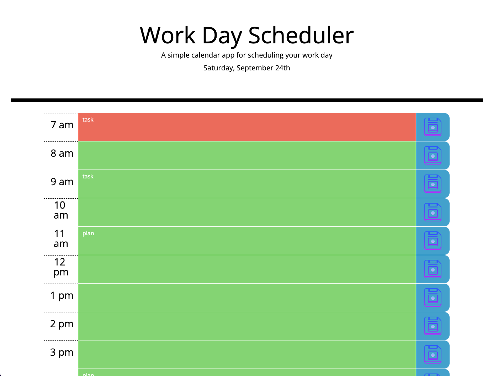

# Code Challenge 05: Work Day Scheduler

## Description

The Work Day Scheduler was the fifth challenge in our web development bootcamp. It was designed to challenge us with applying 
what we had learned that week about third party APIs. Some of the new tools I used were:
- Using moment.js to display the current date and keep track of time
- Using the appropriate link and script tags to bring in the third party api data
- Using bootstrap to provide CSS styling rules
- Using bootstrap's grid system

## Installation

N/A

## Usage

To use this application you can type any event you would like to save to your planner in whichever timeslot you need and click the blue save button on the right. Clicking the blue save button will store your scheduled event to local memory. If you type a replace a previous event with a new one the time slot will be updated in local storage as well. If the event is deleted and you save the now empty time slot, the application will update that as well in local memmory. Each time slot's color will update to a different color depending on the tim. Green = upcoming, Red = present time, Grey = past time. To visit the deployed application follow this link: 
https://trufl.github.io/daily-planner/

    

## Credits

N/A

## License

N/A